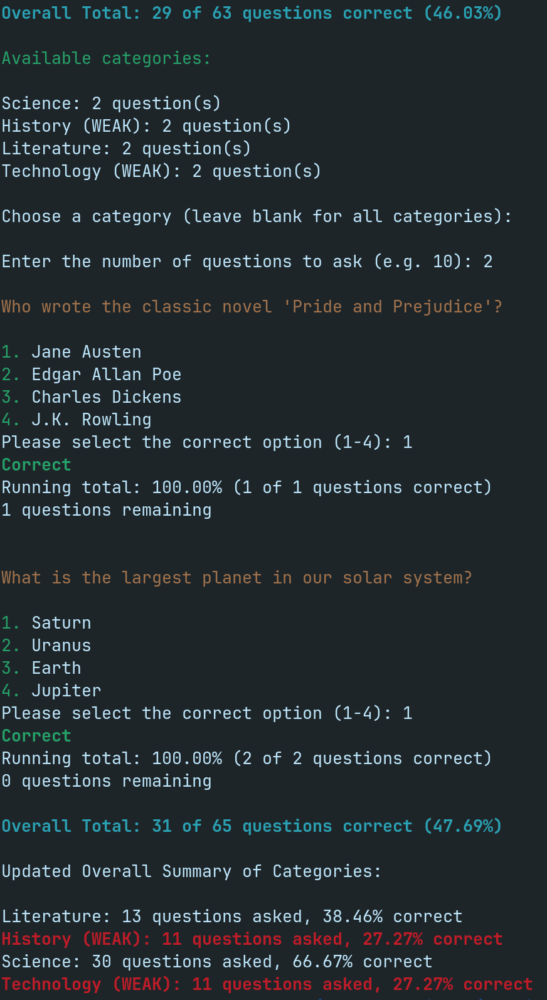

# terminalTrivia
A multiple choice quiz command line done entirely in the command line. Questions are pulled from a csv file. Each question has a category which is used to summarise quiz results. Users can focus entirely on one category or many categories for a user defined amount of questions. After 10 questions in a category have been answered, the category summary will state whether a category is STRONG (>90%) or WEAK (<30%).

To run:
```commandline
python3 terminalTrivia.py
```

The results are stored in output.csv but the tool summarises this for you.



Feel free to use and suggest further improvements.